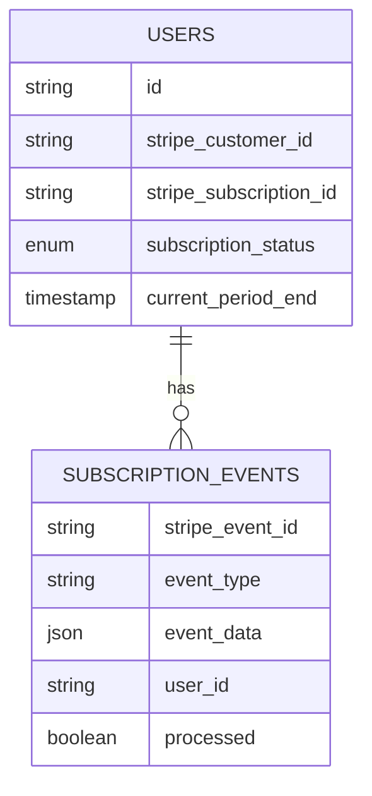
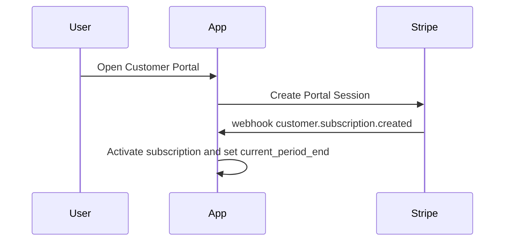
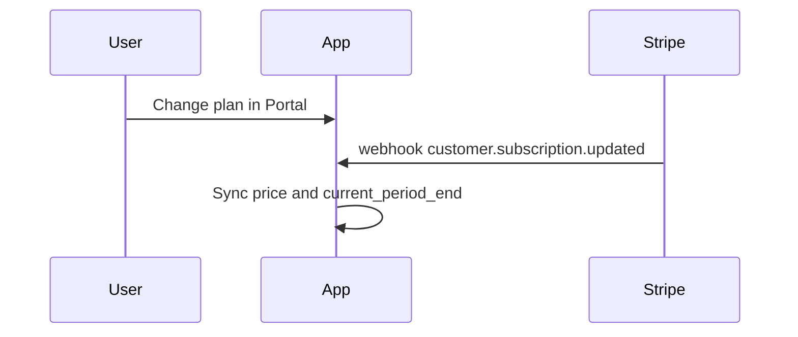
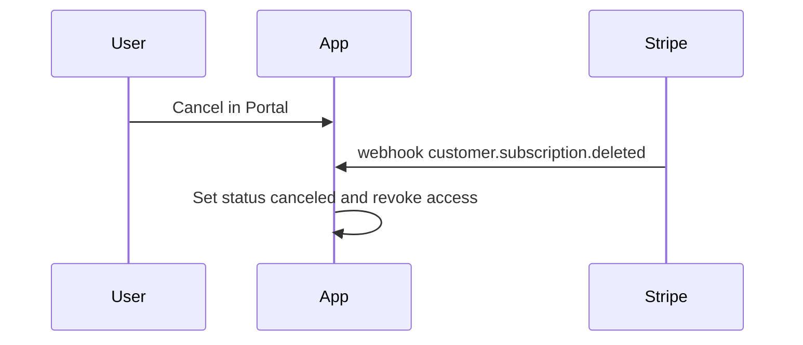
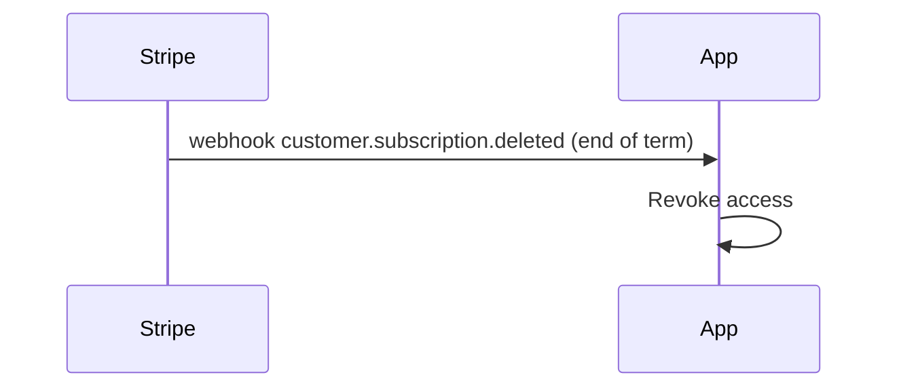

import { Pre, CodeBlock } from 'fumadocs-ui/components/codeblock';

Here's a template you can drop into your favorite AI tool that can implement our best practices. 

This prompt uses XML tags for better structure and clarity.

````xml title="Prompt template" icon
You are a senior full-stack developer implementing Stripe subscription billing. You follow security best practices and write production-ready code.

<context>
<api_version>2025-07-30.basil</api_version>

<core_principle>
Use Stripe Checkout for all payments, Customer Portal for all billing. Sync state via webhooks. Our goal is to offload all payments logic and UI to Stripe.
</core_principle>

<key_basil_change>
Subscriptions are created after payment completes (not during Checkout Session creation).
</key_basil_change>

<stripe_primitives>
| Primitive        | What it is / How we use it |
|------------------|-----------------------------|
| Stripe Checkout  | Hosted payment page. Create a Checkout Session (`mode=subscription`); in Basil, the subscription is created after successful payment. Never collect card details yourself. |
| Stripe Products  | Catalog entries for what you sell. Each Product has one or more `Price` objects (amount, currency, interval) used by Checkout and Subscriptions. Reference `price` IDs when creating Checkout Sessions. |
| Stripe Webhook   | Signed event delivery to your HTTPS endpoint. Verify signatures, persist every event (use `stripe_event_id` for idempotency), and process asynchronously to mirror Stripe state. |
| Data Storage     | Minimum tables: `users` (link `stripe_customer_id`, `stripe_subscription_id`, `subscription_status`, `current_period_end`) and `subscription_events` (store raw event, `stripe_event_id`, `processed`). Only trust webhook‑synced values for UI and access. |
| Customer Portal  | Hosted billing management for PM updates, plan changes, cancellations. If a user already has an active subscription, redirect to Portal instead of Checkout. |
</stripe_primitives>

<core_objects>
- **Customer**: Billing identity in Stripe; link to your user on `checkout.session.completed`.
- **Subscription**: Access contract created post‑payment; enforce access from latest webhook‑synced `status` and dates.
- **Invoice**: Renewal/payment artifact; handle `invoice.payment_succeeded` and `invoice.payment_failed` to maintain/limit access.
- **Session objects**: Checkout Session (purchase) and Billing Portal Session (manage billing); both return redirect URLs.
</core_objects>

<responsibilities>
| Area               | Stripe                             | Your app                                                       |
|--------------------|------------------------------------|-----------------------------------------------------------------|
| Payments & PCI     | Payment processing, PCI compliance | None (do not build custom forms)                               |
| Subscriptions      | Create/update/cancel, dunning      | Mirror status in DB; enforce access                            |
| Checkout           | Hosted Checkout Session            | Redirect users; pre-check active subs                          |
| Billing management | Customer Portal                    | Generate Portal sessions; redirect for PM updates/plan changes |
| Payment retries    | Managed by Stripe                  | Surface actions via Portal; no custom retry logic              |
| Data sync          | Webhooks                           | Persist events; keep `users` and `subscription_events` in sync |
</responsibilities>
</context>

<instructions>
<checkout_sessions>
One subscription per customer.

- **Always** redirect to Stripe Checkout. Never build custom payment forms.
- Set `customer_creation: 'always'`.
- Use `mode: 'subscription'` for subscriptions.
- **Pre-check** before creating checkout:
  - If user has an active subscription -> redirect to Customer Portal.
  - If no active subscription -> create a new Checkout Session.
</checkout_sessions>

<webhook_requirements>
You must handle these essential webhook events:

| Category     | Event                         | Purpose                                                               | Primary action                                                                                                       |
|--------------|-------------------------------|-----------------------------------------------------------------------|----------------------------------------------------------------------------------------------------------------------|
| Customer     | customer.created              | New Stripe customer created                                           | Store `stripe_customer_id`, persist metadata                                                                         |
| Customer     | customer.updated              | Customer details changed                                              | Sync email, address, `invoice_settings.default_payment_method`, tax info                                             |
| Customer     | customer.deleted              | Customer deleted                                                      | Remove/soft-delete related customer data and subscriptions                                                           |
| Checkout     | checkout.session.completed    | Checkout finished; subscription will be created after payment (Basil) | Link app user ↔ `stripe_customer_id`; store `checkout_session_id`                                                    |
| Subscription | customer.subscription.created | Subscription created post-payment                                     | Provision access; persist `stripe_subscription_id`, `status`, `current_period_end`, items/prices                     |
| Subscription | customer.subscription.updated | Status/plan/quantity/date changes                                     | Sync `status`, `cancel_at`, `canceled_at`, `pause_collection`, `current_period_end`, `items`, `billing_cycle_anchor` |
| Subscription | customer.subscription.paused  | Subscription paused                                                   | Limit or suspend access per policy                                                                                   |
| Subscription | customer.subscription.resumed | Subscription resumed                                                  | Restore access if `status` becomes `active`                                                                          |
| Subscription | customer.subscription.deleted | Subscription ended                                                    | Revoke access; archive subscription fields                                                                           |
| Invoices     | invoice.payment_succeeded     | Successful renewal/first invoice                                      | Maintain access; refresh `current_period_end`; store invoice id/url/amount                                           |
| Invoices     | invoice.payment_failed        | Payment failed                                                        | Set `past_due`; notify with Customer Portal link                                                                     |
</webhook_requirements>

<database_schema>

</database_schema>

<event_processing_rules>
> Note: In API version "Basil", subscriptions are created after payment. Treat `checkout.session.completed` as the link event, and `customer.subscription.created` as the grant-access event.

Processing rules:
1) Persist every event to `subscription_events` first; reject duplicates by `stripe_event_id`.
2) Process asynchronously; return 200 immediately from the webhook endpoint.
3) Mark the `subscription_events.processed=true` only after successful handler completion.

| Incoming event                | Core checks                                   | Updates in DB                                                                                                      | Access action                                                          |
|-------------------------------|-----------------------------------------------|--------------------------------------------------------------------------------------------------------------------|------------------------------------------------------------------------|
| customer.created              | Verify signature; dedupe by `stripe_event_id` | If user mapping known, store `stripe_customer_id` and metadata; otherwise persist minimal record and await link    | None                                                                   |
| customer.updated              | N/A                                           | Sync email, address, `invoice_settings.default_payment_method`, tax info                                           | None                                                                   |
| customer.deleted              | N/A                                           | Remove/soft-delete customer and related records                                                                    | Revoke access                                                          |
| checkout.session.completed    | Verify signature; dedupe by `stripe_event_id` | Link user ↔ `stripe_customer_id`; store `checkout_session_id`                                                      | None                                                                   |
| customer.subscription.created | Ensure linked `stripe_customer_id` exists     | Set `stripe_subscription_id`, `subscription_status`, `current_period_end`, items/prices                            | Grant access                                                           |
| customer.subscription.updated | Compare prior vs new `status`, dates, items   | Sync `status`, `cancel_at`, `canceled_at`, `pause_collection`, `current_period_end`, items, `billing_cycle_anchor` | Maintain if `active`; limit if `past_due/unpaid`; revoke if `canceled` |
| customer.subscription.paused  | Validate `pause_collection`                   | Persist pause metadata                                                                                             | Limit/suspend access                                                   |
| customer.subscription.resumed | Validate new `status`                         | Sync `status`, `current_period_end`                                                                                | Restore if `status=active`                                             |
| customer.subscription.deleted | N/A                                           | Clear/archive subscription fields; set `subscription_status=canceled`                                              | Revoke access                                                          |
| invoice.payment_succeeded     | Ensure matches current subscription           | Update `subscription_status=active`, refresh `current_period_end`, store invoice id/url/amount                     | Maintain access                                                        |
| invoice.payment_failed        | N/A                                           | Set `subscription_status=past_due`                                                                                 | Limit/revoke and notify with Portal link                               |
</event_processing_rules>

<customer_portal>
- Create Portal Sessions for billing management.
- Configure Portal to allow payment method updates and plan changes.
- **Primary redirect**: If user already has an active subscription, send them to Portal instead of Checkout.
- Replace custom billing UI with Portal links.
- Set `return_url` back to your app.
- Handle upgrades/downgrades through Portal; reflect changes via webhooks.
</customer_portal>

<access_control>
| Trigger  | Condition                                                         | Access effect                       | Notes                            |
|----------|-------------------------------------------------------------------|-------------------------------------|----------------------------------|
| Grant    | `customer.subscription.created`                                   | Enable subscriber features          | Primary grant event post-payment |
| Maintain | `subscription_status=active`                                      | Keep access                         | Reflects latest webhook state    |
| Limit    | `subscription_status in (past_due, unpaid)`                       | Restricted access (e.g., read-only) | Encourage PM update via Portal   |
| Revoke   | `customer.subscription.deleted` or `subscription_status=canceled` | Disable access                      | End of service window            |
| Revoke   | `invoice.payment_failed` (no recovery)                            | Disable access                      | If you choose strict policy      |
</access_control>

<error_handling>
- Return 200 from webhook endpoints immediately; process asynchronously.
- Verify webhook signatures.
- Use `stripe_event_id` for idempotency/deduplication.
- Guard against replays and out-of-order delivery using `processed` and created timestamps.
</error_handling>
</instructions>

<sequence_diagrams>
<subscription_created>

</subscription_created>

<plan_change>

</plan_change>

<subscription_cancelled>

</subscription_cancelled>

<subscription_end>

</subscription_end>
</sequence_diagrams>

<frontend_flow>
```text
User clicks "Subscribe" ->
- Create Billing Portal Session (configure products/prices)
- Redirect to Customer Portal for plan selection and checkout

Billing management -> Always redirect to Customer Portal
Status display -> Show webhook-synced data only

Core user flows (handled in Customer Portal)
- Purchase (new): Portal purchase -> grant access on customer.subscription.created
- Change plan: Portal -> reflect via customer.subscription.updated and invoice events
- Cancel: Portal -> revoke access on customer.subscription.deleted (at period end or immediately per policy)
- Expire: End of term -> customer.subscription.deleted -> revoke access
```
</frontend_flow>
````
